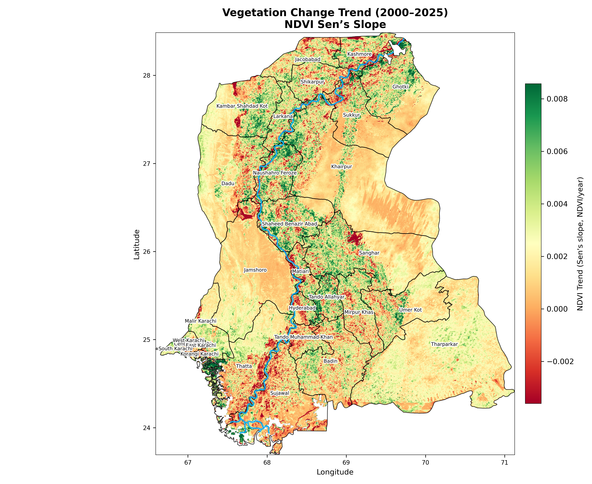
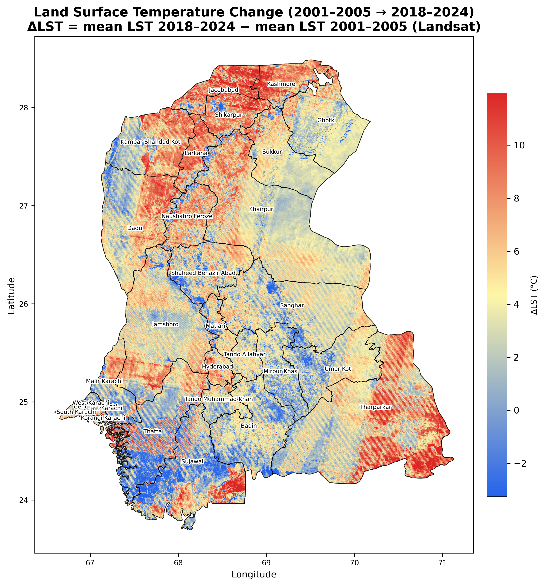
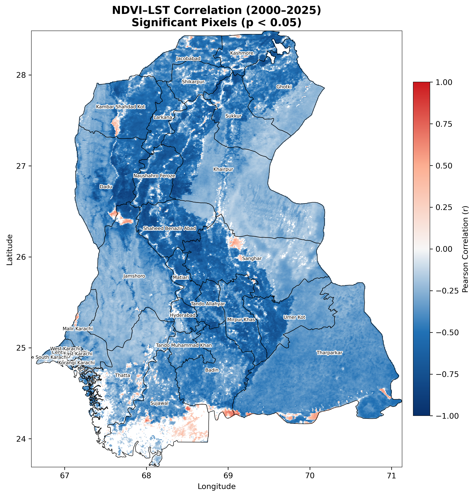
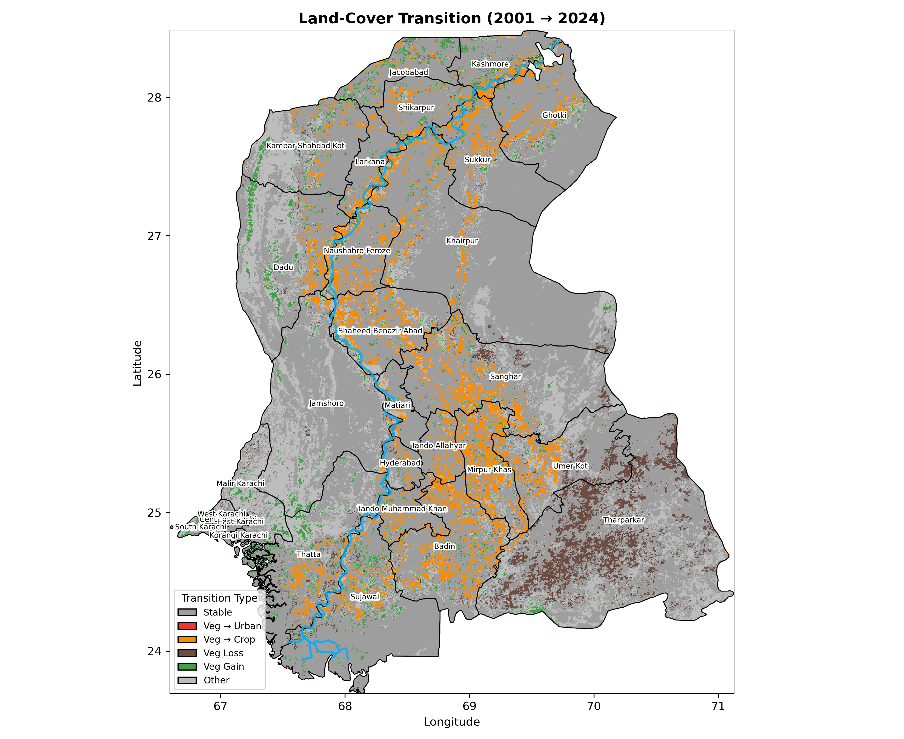
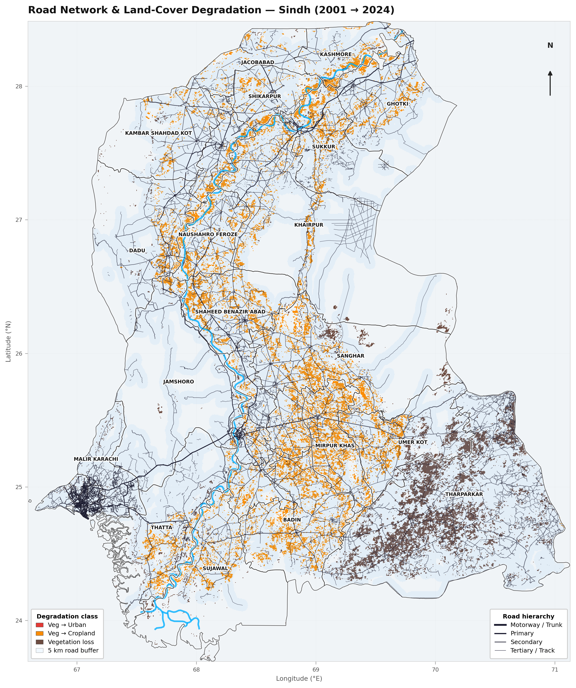
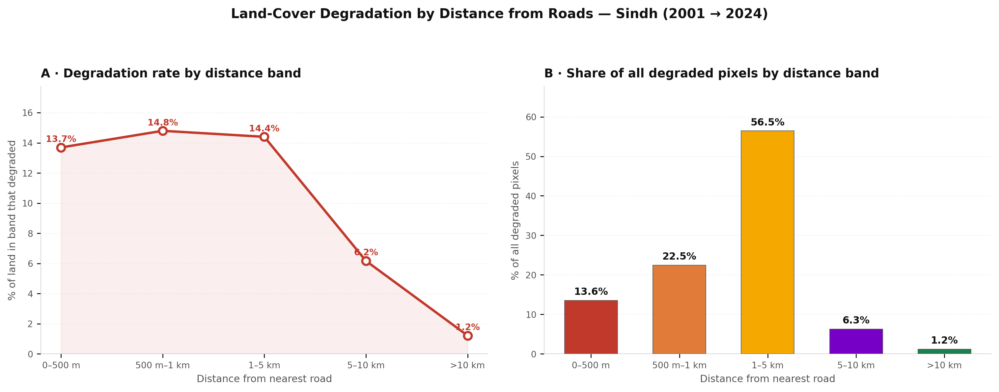

# Sindh Forest Degradation & LST Trend Analysis

A reproducible geospatial study investigating vegetation degradation, land-cover change, land surface temperature dynamics, and infrastructure pressure across **Sindh, Pakistan**, using satellite data from **2000–2025**.

---

## 🌍 Project Background

Earlier this year, while taking a Spatial Data Science course, I came across an Eos article in *Dawn* titled **"The Lost Forests of Sindh."**

The article discussed how decades of deforestation, expanding infrastructure, and weak forest protection have contributed to shrinking riverine forests, rising land surface temperatures, and wider ecological degradation across Sindh.

Rather than simply accepting these claims, I wanted to investigate:

> **Can publicly available Earth observation data be used to independently examine these environmental changes across Sindh?**

This project was the result.

Over the course of the project, I built a reproducible geospatial workflow using **Google Earth Engine, Python, and QGIS**, analyzing roughly **25 years of satellite-derived data (2000–2025)**.

Rather than attempting to prove or disprove a single claim, the analysis focuses on several measurable questions about vegetation, temperature, land-cover change, and human infrastructure.

---

# 🔬 Research Questions

The analysis focuses on five main questions:

1. 🌱 **Is vegetation declining across Sindh?**
2. 🌡️ **Is land surface temperature increasing?**
3. 🌿 **What is the relationship between vegetation and surface temperature?**
4. 🛰️ **How is land cover changing over time?**
5. 🛣️ **Is landscape degradation spatially associated with infrastructure?**

---

# 📊 Key Results

## 🌱 1. Vegetation Change — NDVI Sen's Slope



To investigate long-term vegetation change, I analyzed a multi-year **NDVI time series** and calculated **Sen's Slope** for each pixel.

**Result: most of Sindh became greener, not browner.**

| NDVI trend (Sen's slope, 2000–2025) | Share of valid pixels |
|---|---|
| Positive slope (any greening) | **88.6%** |
| Negative slope (any browning) | 11.4% |
| Greening class (> +0.002 NDVI/yr) | 44.5% |
| Browning class (< −0.002 NDVI/yr) | 4.0% |

Median slope: **+0.0018 NDVI/year**. The strongest greening is on the irrigated Indus plain, which points to agricultural intensification rather than forest recovery. The deserts show near-zero slopes. Browning is localized, most visibly in the **lower Indus delta (Thatta, Sujawal)** and in strips along the river, where Sindh's riverine forests are.

### Interpretation

- **Negative Sen's slope** → declining vegetation trend
- **Positive Sen's slope** → increasing vegetation trend
- Values close to zero → relatively stable vegetation

This provides a spatial representation of where vegetation conditions have changed most consistently during the study period.

---

## 🌡️ 2. Land Surface Temperature Change



I analyzed changes in **Land Surface Temperature (LST)** from Landsat thermal bands:

> **ΔLST = mean LST 2018–2024 (Landsat 8/9) − mean LST 2001–2005 (Landsat 5/7)**

**Result:** **83.8%** of valid pixels warmed by more than 0.5 °C, 5.5% were stable (±0.5 °C) and 10.7% cooled. Mean ΔLST is **+4.2 °C**. Warming is strongest in **northern Sindh** (Jacobabad, Kashmore, Larkana) and **eastern Tharparkar**.

These percentages cover valid pixels only. An earlier version counted no-data pixels outside the province as "warming".

### Interpretation

The analysis classifies areas into:

- 🔵 **Cooling**
- ⚪ **Stable**
- 🔴 **Warming**

> **Note:** LST represents the temperature of the land surface derived from satellite observations. It should not be interpreted as equivalent to near-surface air temperature.

> **Artefacts:** The map shows two kinds of striping. (1) Fine ~500 m near-horizontal hatching: scan/detector striping from the whiskbroom TM/ETM+ thermal bands in the early composite. An FFT confirms the ~500 m period. It is **not** Landsat 7 SLC-off gaps, because Landsat 7 is used only before May 2003. (2) Broad diagonal bands: Landsat WRS-2 path boundaries, caused by averaging different numbers and seasons of scenes per path. Read pixel-level values near path edges with caution. See notebook §3.3 for details and a suggested fix.

---

## 🌿 3. Vegetation vs. Surface Temperature



To investigate the relationship between vegetation and surface temperature, I performed a **pixel-wise NDVI–LST correlation analysis**.

The analysis reveals a predominantly **negative relationship** between vegetation and land surface temperature. It uses monthly MODIS NDVI and LST from 2000–2025:

- **96.2%** of pixels have a statistically significant correlation (p < 0.05)
- **98.2%** of those significant pixels are **negative**
- Median Pearson r across Sindh: **−0.36**

In general:

> Areas with higher vegetation conditions tend to correspond to lower surface temperatures, while areas with lower vegetation tend to exhibit higher surface temperatures.

This pattern is consistent with vegetation's role in moderating surface heat.

However, the correlation represents an **association rather than proof of causation**. Other environmental and land-use factors can also influence surface temperature.

---

## 🛰️ 4. Land-Cover Transitions



To understand *how* the landscape changed, rather than only measuring vegetation trends, I analyzed **land-cover transitions**.

The transition raster was decoded into categories representing changes such as:

| Transition (MODIS MCD12Q1, 2001 → 2024) | Pixels (500 m) | % of valid |
|---|---:|---:|
| Stable | 431,658 | 68.1% |
| Vegetation → cropland | 50,074 | 7.9% |
| Vegetation loss (→ barren / water) | 25,046 | 3.9% |
| Vegetation gain (cropland / barren → vegetation) | 21,192 | 3.3% |
| Vegetation → urban | 12 | <0.01% |
| Other transitions (e.g. water → vegetation, barren → water) | 106,169 | 16.7% |

No-data pixels (outside Sindh, 443,519 px) are excluded. An earlier version counted them as "Stable".

The main change is conversion of natural vegetation to **cropland**, along the Indus and across Sanghar, Mirpur Khas and Badin. Vegetation loss is concentrated in the **Tharparkar desert**. There it likely reflects sparse shrubland classified as barren in 2024, a label that depends on the rainfall in the two years compared, so it shouldn't be read as forest loss.

This analysis provides additional context for interpreting the NDVI trends.

---

## 🛣️ 5. Infrastructure Pressure



Finally, I investigated whether land-cover degradation was spatially associated with transportation infrastructure.

Major roads were converted into a raster representation and **Euclidean distance from roads** was calculated.

**Degradation** means natural vegetation converted to urban, cropland, or barren/water between 2001 and 2024. Vegetation gain is not counted. For each distance band I report two different statistics:

- **Rate**: the percentage of land *in the band* that degraded
- **Share**: the percentage of *all degraded pixels* that fall in the band

| Distance from road | Rate | Share | Degraded px | Land px |
|---|---:|---:|---:|---:|
| 0–500 m | 13.7% | 13.6% | 10,192 | 74,416 |
| 500 m–1 km | 14.8% | 22.5% | 16,894 | 114,159 |
| 1–5 km | 14.4% | 56.5% | 42,415 | 294,533 |
| 5–10 km | 6.2% | 6.3% | 4,724 | 76,567 |
| > 10 km | 1.2% | 1.2% | 907 | 74,476 |
| **All of Sindh** | **11.8%** | 100% | 75,132 | 634,151 |

- Within **1 km** of a road, **14.4%** of land degraded (rate), and this zone holds **36.1%** of all degradation (share) on 29.7% of the land.
- The rate is roughly flat at **~14% up to 5 km**, then drops to 6.2% at 5–10 km and 1.2% beyond 10 km.
- **92.5%** of all degradation lies within 5 km of a road. However, 76.2% of Sindh is within 5 km of a road (the network includes tracks), so this share mostly reflects how much land is near roads.



### Interpretation

The data show a threshold rather than a steady distance-decay: land within ~5 km of roads degrades at a similar rate, while remote land (> 5 km) degrades much less.

However, this should **not** be interpreted as evidence that roads directly caused degradation.

Road proximity may also act as a proxy for:

- accessibility
- settlements
- agricultural expansion
- development
- other human activities

---

# 🔄 Analytical Workflow

The overall workflow combines Google Earth Engine, Python, and GIS analysis.

```text
                 ┌─────────────────────┐
                 │ Earth Observation   │
                 │       Data          │
                 └──────────┬──────────┘
                            │
                            ▼
                 ┌─────────────────────┐
                 │ Google Earth Engine │
                 │   Data Processing   │
                 └──────────┬──────────┘
                            │
              ┌─────────────┼─────────────┐
              ▼             ▼             ▼
            NDVI           LST        Land Cover
              │             │             │
              └─────────────┼─────────────┘
                            │
                            ▼
                 ┌─────────────────────┐
                 │ Python Geospatial   │
                 │      Analysis       │
                 └──────────┬──────────┘
                            │
          ┌─────────────────┼─────────────────┐
          ▼                 ▼                 ▼
     Trend Analysis    Correlation       Transitions
          │                 │                 │
          └─────────────────┼─────────────────┘
                            │
                            ▼
                 ┌─────────────────────┐
                 │  Road-Proximity     │
                 │     Analysis        │
                 └──────────┬──────────┘
                            │
                            ▼
                 ┌─────────────────────┐
                 │ Maps & Statistics   │
                 │   (outputs/)        │
                 └─────────────────────┘
```

---

# 🧪 Methodology

## 1. Study Area

The analysis covers **Sindh Province, Pakistan**, using district boundaries and river networks as supporting spatial layers.

All spatial datasets are reprojected and aligned as required for consistent raster and vector analysis.

---

## 2. Vegetation Trend Analysis

The vegetation analysis uses NDVI and **Sen's Slope** to estimate long-term pixel-wise vegetation trends.

Input:

```text
ndvi_sens_slope.tif
```

Output:

* vegetation greening
* vegetation browning
* spatial distribution of long-term vegetation trends

Source: MODIS MOD13Q1 (250 m), annual median NDVI 2000–2025 (`GEE/GEE_script1.js`). The ±0.002 NDVI/yr greening/browning classes are thresholds, not a statistical significance test.

---

## 3. Land-Cover Transition Analysis

The project uses a land-cover transition raster:

```text
lc_transition.tif
```

Encoded transition values are decoded into interpretable categories such as:

* stable land cover
* vegetation → urban
* vegetation → cropland
* vegetation loss (→ barren / water)
* vegetation gain (cropland / barren → vegetation)
* other transitions

Source: MODIS MCD12Q1 (500 m), 2001 vs 2024, encoded as `from_class × 10 + to_class` (`GEE/GEE_script2.js`). Value 0 is no-data and is excluded from all statistics.

This allows land-cover change to be analyzed spatially rather than relying solely on vegetation indices.

---

## 4. Land Surface Temperature

The project analyzes changes in land surface temperature using:

```text
delta_lst_landsat.tif
```

Pixels are classified into:

* cooling (ΔLST < −0.5 °C)
* stable (−0.5 to +0.5 °C)
* warming (> +0.5 °C)

Source: Landsat Collection 2 Level-2 surface temperature at 30 m, mean 2018–2024 minus mean 2001–2005 (`GEE/GEE_script3.js`). Only valid (non-NaN) pixels are classified.

The resulting ΔLST layer is used both independently and alongside vegetation trends.

---

## 5. NDVI–LST Correlation

A pixel-level correlation analysis is used to examine the relationship between vegetation and surface temperature.

The resulting raster highlights areas where the relationship between NDVI and LST is stronger or weaker.

Source: MODIS MOD13A2 NDVI and MOD11A2 daytime LST (1 km), monthly means 2000–2025 (`GEE/GEE_script4.js`). Only pixels with p < 0.05 are mapped.

---

## 6. Infrastructure Proximity

OpenStreetMap roads (motorway, trunk, primary, secondary, tertiary, track) are rasterized onto the 500 m land-cover grid, and Euclidean distance to the nearest road is calculated.

Degradation rate and share are then compared across distance bands to investigate whether degradation is spatially concentrated near infrastructure.

---

# 🗂️ Data

The raster inputs are exported from Google Earth Engine using the scripts in [`GEE/`](GEE/). They are **not stored in this repository**: the ΔLST raster alone is ~1.6 GB. To reproduce the analysis, run each script in the [GEE Code Editor](https://code.earthengine.google.com/) and place the exported files in `data/`:

| File | Produced by | Contents |
|---|---|---|
| `ndvi_sens_slope.tif` | `GEE/GEE_script1.js` | NDVI Sen's slope, MODIS 250 m, 2000–2025 |
| `lc_transition.tif` | `GEE/GEE_script2.js` | Land-cover transition codes, MODIS 500 m, 2001 → 2024 |
| `delta_lst_landsat.tif` | `GEE/GEE_script3.js` | ΔLST, Landsat 30 m, 2018–2024 vs 2001–2005 |
| `ndvi_lst_corr.tif` | `GEE/GEE_script4.js` | Pearson r and p-value, MODIS 1 km, 2000–2025 |
| `sindh_roads.gpkg` | OpenStreetMap | Road network for Sindh (~90 MB, not stored) |

The scripts reference Sindh boundary assets in my Earth Engine project, so you will need to upload your own province/district boundaries and update the asset paths.

Stored in the repo: `data/sindh_districts.gpkg` (district boundaries) and `data/ne_10m_rivers_lake_centerlines.zip` (Natural Earth rivers).

---

# 📁 Repository Structure

```text
.
├── main.ipynb              # full analysis notebook
├── GEE/
│   ├── GEE_script1.js      # NDVI Sen's slope (MODIS)
│   ├── GEE_script2.js      # land-cover transitions (MODIS)
│   ├── GEE_script3.js      # ΔLST (Landsat)
│   └── GEE_script4.js      # NDVI–LST correlation (MODIS)
├── data/
│   ├── sindh_districts.gpkg
│   ├── ne_10m_rivers_lake_centerlines.zip
│   └── (GEE exports + roads — not in repo, see Data)
├── outputs/                # figures generated by the notebook
├── requirements.txt
├── LICENSE
└── README.md
```

---

# 🚀 How to Run

## 1. Clone the repository

```bash
git clone https://github.com/abdurafay19/sindh-vegetation-lst-analysis.git
cd sindh-vegetation-lst-analysis
```

## 2. Set up the Python environment

```bash
python -m venv .venv && source .venv/bin/activate
pip install -r requirements.txt jupyter
```

`requirements.txt` pins the versions the notebook was last run with (Python 3.11).

## 3. Open the notebook

```bash
jupyter notebook main.ipynb
```

or open the project using JupyterLab.

## 4. Configure paths

Set `DATA_PATH` and `OUTPUT_PATH` in the setup section of the notebook if necessary.

## 5. Run the notebook

Execute the cells from top to bottom.

The notebook performs the data loading, raster processing, classification, spatial analysis and mapping, and writes all figures to `outputs/`.

---

# 🛰️ Google Earth Engine

The repository also contains the Google Earth Engine scripts used to prepare and export raster layers for the Python analysis:

```text
GEE/GEE_script1.js
GEE/GEE_script2.js
GEE/GEE_script3.js
GEE/GEE_script4.js
```

These scripts can be used to reproduce or refresh the Earth Engine-derived datasets used by the project.

---

# 🛠️ Technologies

### Geospatial & Remote Sensing

* Google Earth Engine
* QGIS
* GeoPandas
* Rasterio
* Rioxarray
* Xarray
* Rasterstats
* Shapely

### Data Science

* Python
* NumPy
* Pandas
* SciPy
* Matplotlib
* Seaborn

### Earth Observation

* NDVI
* Land Surface Temperature
* Land-cover data
* Multi-temporal satellite imagery
* OpenStreetMap road data

---

# 📌 Key Findings

The analysis identified several notable spatial patterns:

* 🌱 **Greening dominates:** 88.6% of Sindh shows a positive NDVI trend (2000–2025), strongest in irrigated farmland. Browning is localized (4.0% below −0.002 NDVI/yr), notably in the lower Indus delta.
* 🌡️ **Surface warming is widespread:** 83.8% of valid pixels warmed by more than 0.5 °C between 2001–2005 and 2018–2024 (mean ΔLST +4.2 °C).
* 🌿 **NDVI and LST are negatively correlated:** 98.2% of significant pixels are negative (median r = −0.36).
* 🛰️ **Natural vegetation → cropland** is the largest vegetation transition (7.9% of Sindh). Vegetation loss (3.9%) is concentrated in Tharparkar.
* 🛣️ **Degradation is concentrated near roads:** land within 5 km of a road degraded at ~14%, versus 1.2% beyond 10 km. The 1 km zone holds 36.1% of all degradation on 29.7% of the land.

These findings describe patterns observed in the available datasets and should not be interpreted as definitive causal explanations.

---

# ⚠️ Limitations

This project is an exploratory spatial analysis rather than a definitive assessment of the causes of forest degradation.

Important limitations include:

* Satellite-derived LST represents land surface temperature rather than air temperature.
* Correlation between NDVI and LST does not establish causation.
* Road proximity is an indicator of spatial association and may also represent accessibility and other forms of human activity.
* Land-cover classification and transition results depend on the quality and resolution of the underlying datasets.
* Pixel alignment is important when combining the different raster layers.
* The land-cover comparison uses two single years (2001, 2024). Desert shrubland ↔ barren transitions, especially in Tharparkar, are sensitive to rainfall in those years.
* The ΔLST map contains Landsat scan-striping and path-boundary artefacts (see above), and the two periods are not season-matched.
* NDVI greening/browning classes use fixed slope thresholds, not a significance test.
* Distance bands have unequal areas, so the share of degradation per band partly reflects band size. The rate is the fairer comparison.
* The analysis identifies spatial and temporal patterns but does not independently establish the causal mechanisms behind them.

---

# 🎓 What I Learned

This project was primarily an exercise in applying **Spatial Data Science to a real-world environmental question**.

Through the project I worked with:

* multi-temporal satellite data
* Google Earth Engine
* raster and vector geospatial data
* spatial statistics
* NDVI trend analysis
* Land Surface Temperature
* land-cover transitions
* distance-based spatial analysis
* district-level aggregation
* reproducible Python workflows
* GIS visualization

More importantly, it taught me how to move from a broad real-world question to a set of **measurable spatial hypotheses**, and then investigate them using openly available Earth observation data.

---

# 📚 Motivation

The project was inspired by the *Dawn/Eos* article:

> **"The Lost Forests of Sindh"**

The goal was not to prove the article right or wrong, but to explore whether publicly available Earth observation data could be used to independently investigate some of the environmental patterns discussed in it.

---

# 👤 Author

**Abdul Rafay**, Computer Science student at the Information Technology University (ITU), Lahore, and AI Engineer.

* LinkedIn: [linkedin.com/in/abdurafay19](https://www.linkedin.com/in/abdurafay19)
* GitHub: [github.com/abdurafay19](https://github.com/abdurafay19)

---

# 📄 License

Released under the [MIT License](LICENSE).
